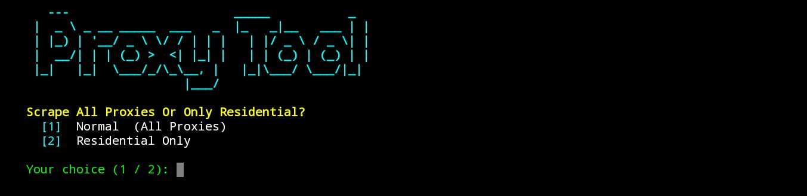

🚀 PROXY SCRAPER & VALIDATOR AIO

⚠️ FOR EDUCATIONAL PURPOSES ONLY

---

⚡ QUICK SETUP

git clone https://github.com/ZensiZapper/ProxyTool.git
cd ProxyTool
pip install -r requirements.txt
python main.py

---

🟣 FEATURES

- ⚡ Scrape proxies from multiple sources
- 🛡️ Validate & filter only HQ proxies
- 🌐 Saves working proxies automatically
- 🚀 Fast & lightweight
- 📂 Clean output system
- 💜 Beginner friendly

---

📸 PREVIEW

  

---

⭐ SUPPORT

If you like this project, give this repo a ⭐
More powerful tools coming soon 👀